# E-Commerce Mobile App

A modern, feature-rich e-commerce mobile application built with Flutter that provides a seamless shopping experience across multiple platforms.

## Features

- **User Authentication**: Secure login, registration, and account management
- **Product Browsing**: Browse through various product categories with search functionality
- **Product Recommendations**: Personalized product recommendations based on user preferences
- **Shopping Cart**: Add, remove, and manage items in your cart
- **Checkout Process - TODO**: Smooth and secure checkout experience
- **Order History - TODO**: Track and view past orders
- **User Profiles**: Manage personal information and preferences

## UI

- **Light mode**:

  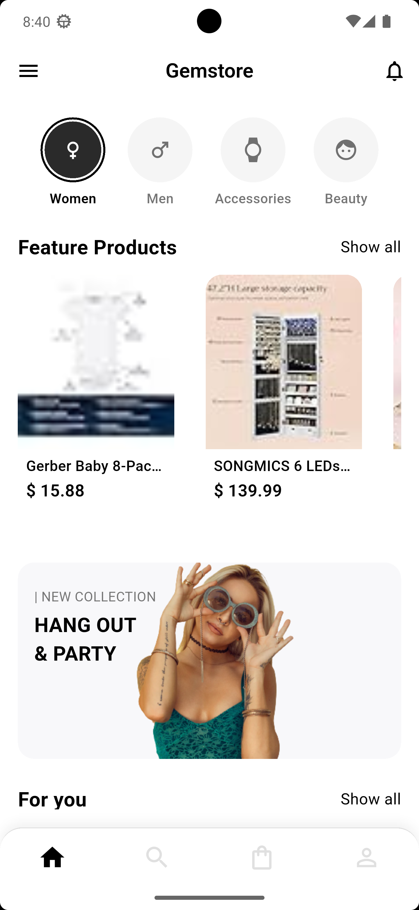
  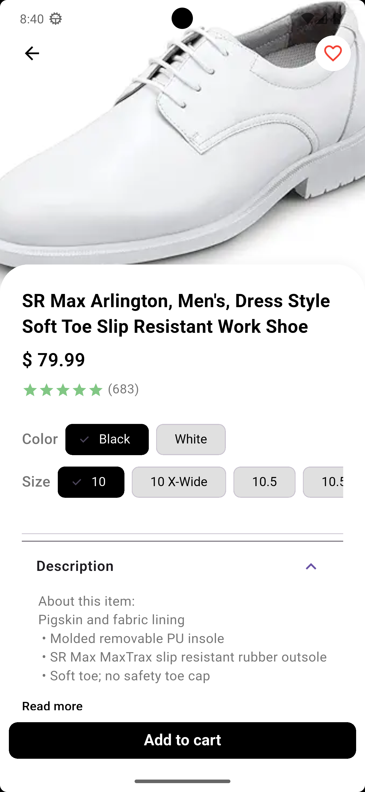
  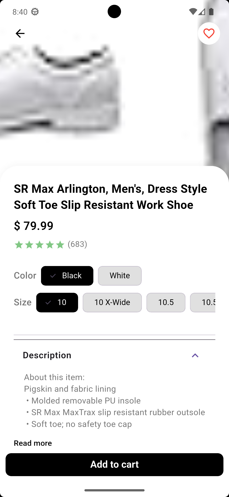
  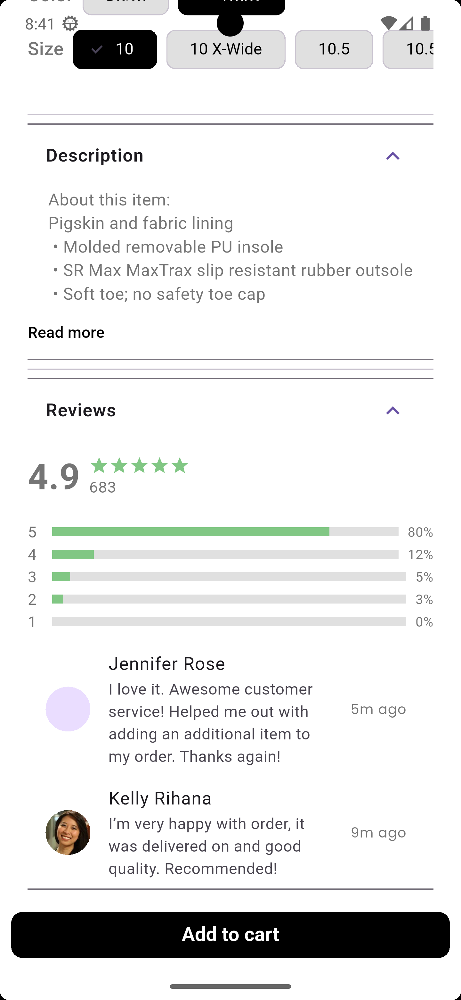
  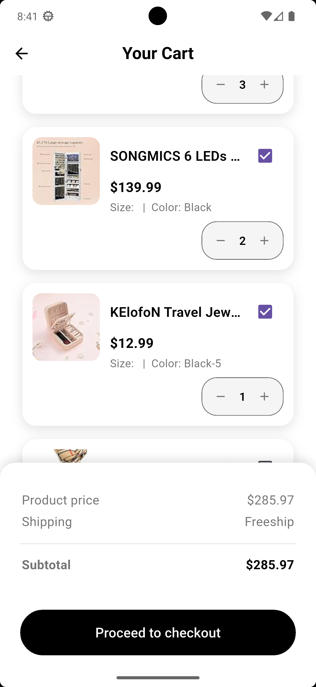
  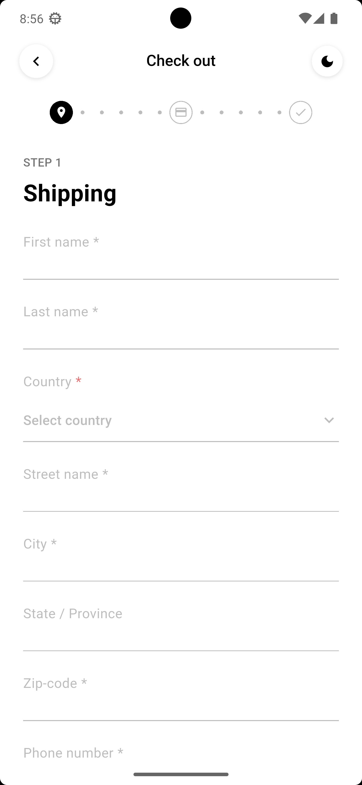
  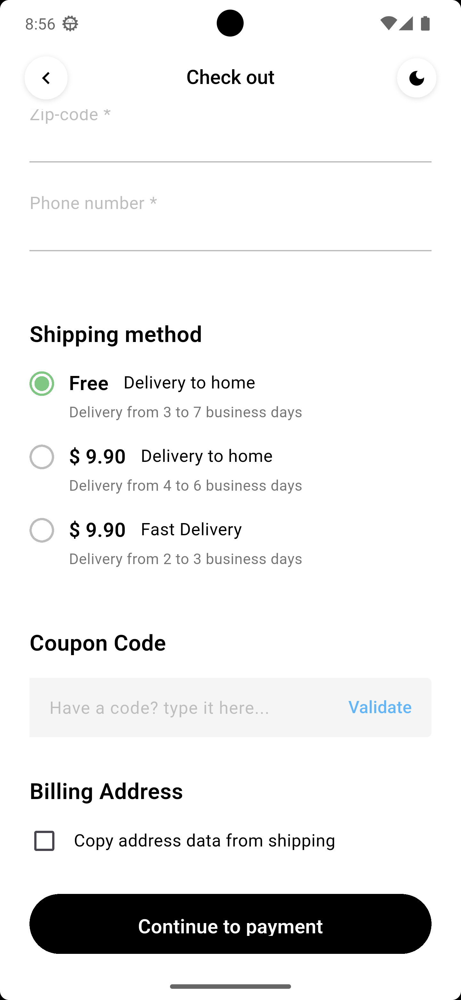
  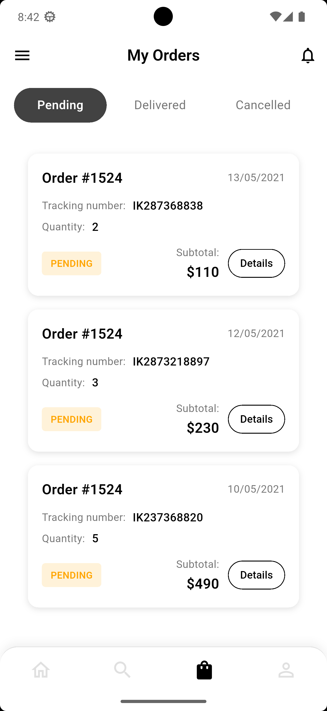
  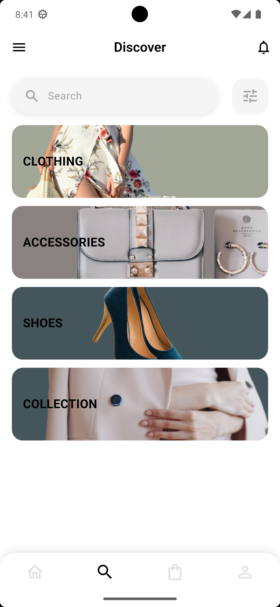
  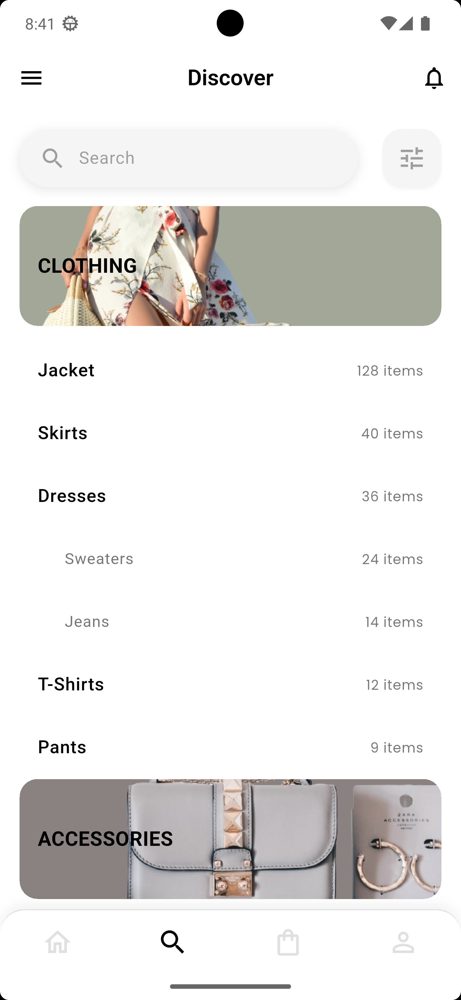
  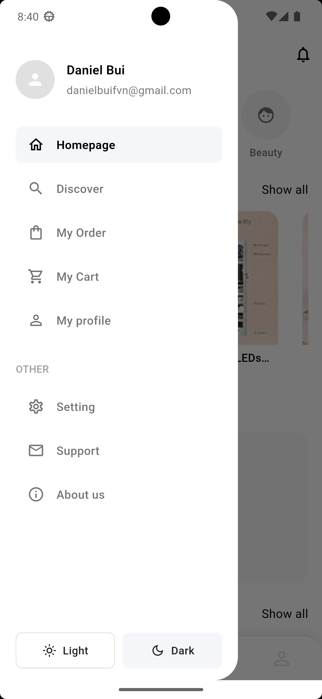
  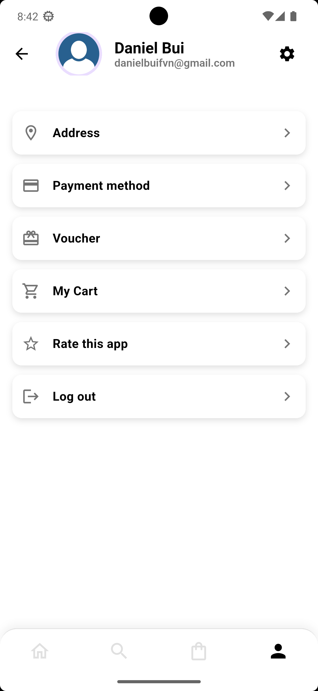
  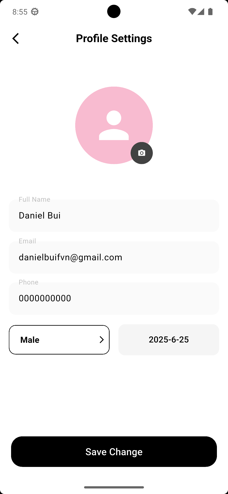

- **Dark mode**:

  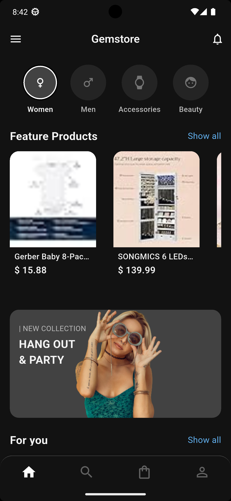
  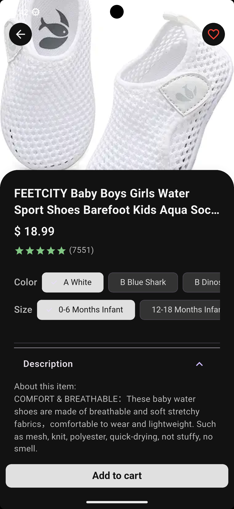
  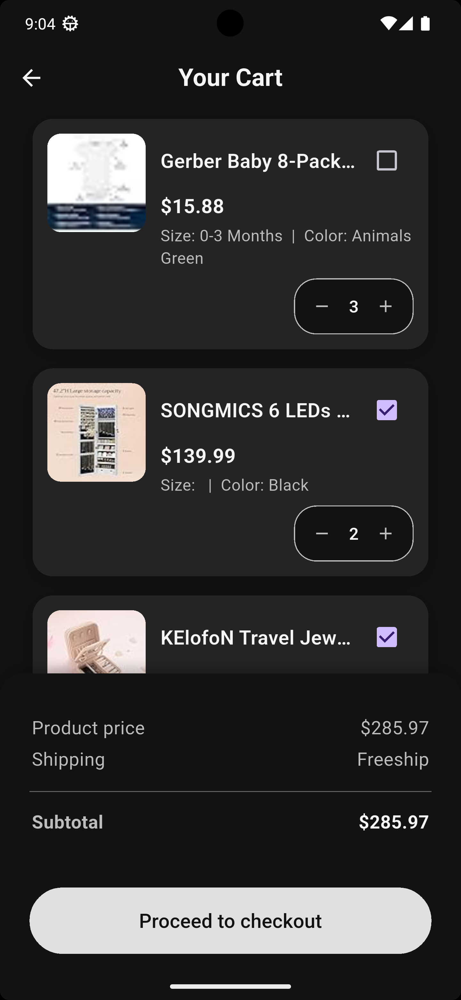
  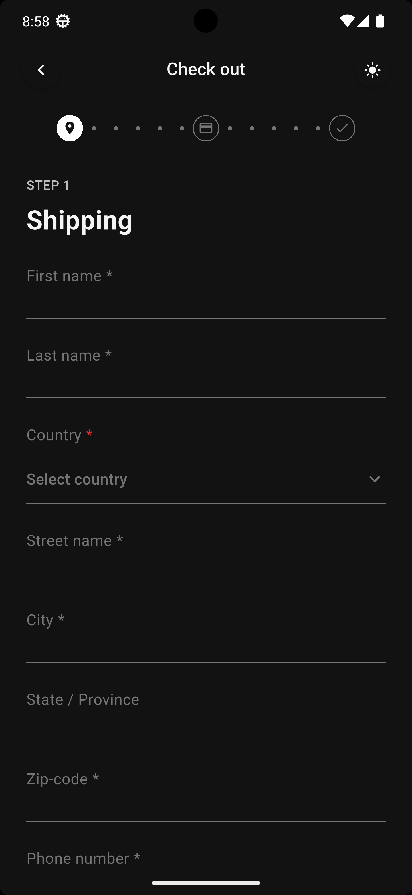
  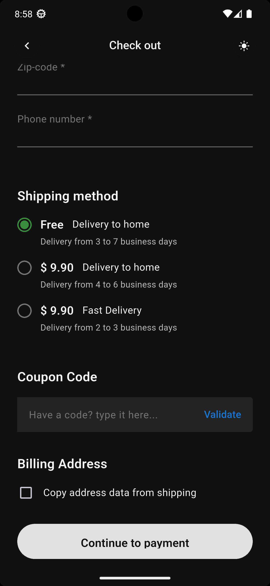
  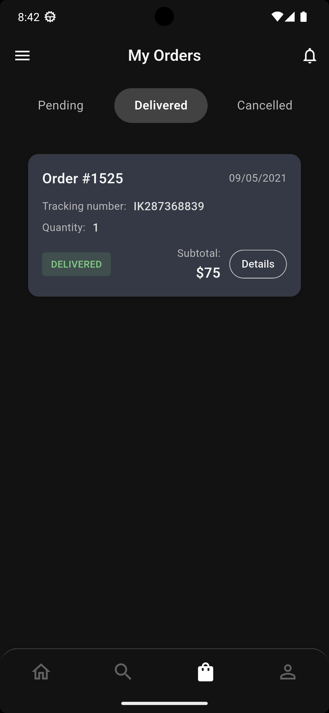
  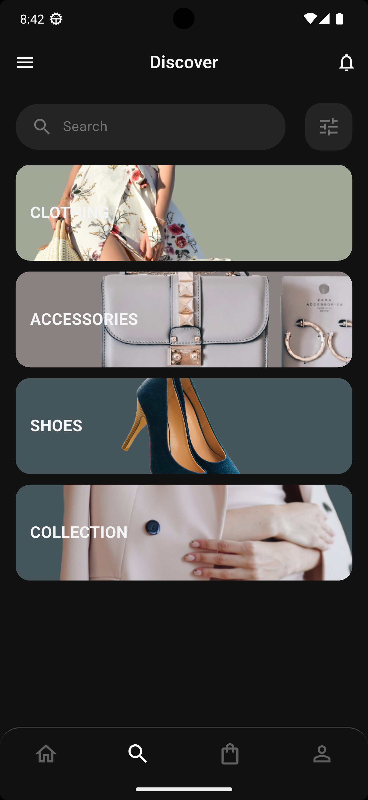
  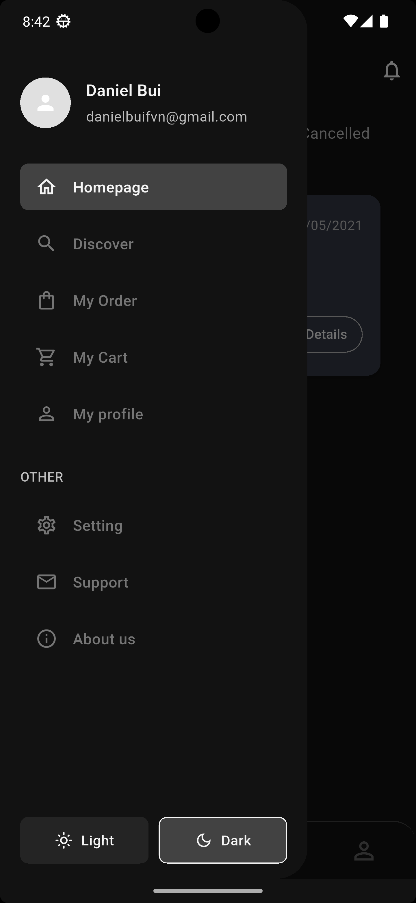

## Technology Stack

- **Frontend**: Flutter
- **State Management**: BLoC pattern
- **Navigation**: Auto Route
- **API Client**: Retrofit, Dio

## Getting Started

### Prerequisites

- Flutter SDK (2.5.0 or higher)
- Dart SDK (2.14.0 or higher)
- Android Studio / VS Code
- An emulator or physical device for testing

### Installation

1. Clone the repository:

```bash
git clone https://github.com/your-username/E-Commerce_FrontEnd.git
cd E-Commerce_FrontEnd
```

2. Install dependencies:

```bash
flutter pub get
```

3. Run the application:

```bash
flutter run
```

## Project Structure

```
lib/
├── main.dart                  # Entry point of the application
├── scr/                       # Source directory
│   ├── core/                  # Core functionality
│   │   ├── common_domain/     # Shared domain components
│   │   └── utils/             # Utility functions and constants
│   ├── domain/                # Business logic
│   │   ├── entities/          # Data models
│   │   └── usecases/          # Business use cases
│   └── presentation/          # UI components
│       ├── bloc/              # BLoC state management
│       └── screens/           # Application screens
```

## Usage

The application starts with a welcome screen that guides users to the main shopping experience. Users can:

1. Sign up or log in to access personalized features
2. Browse products by category or through search
3. View detailed product information
4. Add products to cart and manage cart items
5. Complete purchases through a streamlined checkout process
6. View order history and track current orders

## Known Issues and Solutions

- **Recommendation refresh**: When signing in with different accounts, recommendations might not update automatically. This is being addressed in upcoming updates.

## Contributing

1. Fork the repository
2. Create your feature branch: `git checkout -b feature/amazing-feature`
3. Commit your changes: `git commit -m 'Add some amazing feature'`
4. Push to the branch: `git push origin feature/amazing-feature`
5. Open a pull request

## License

This project is licensed under the MIT License - see the LICENSE file for details.

## Acknowledgements

- Flutter team for the amazing framework
- Contributors who have participated in
